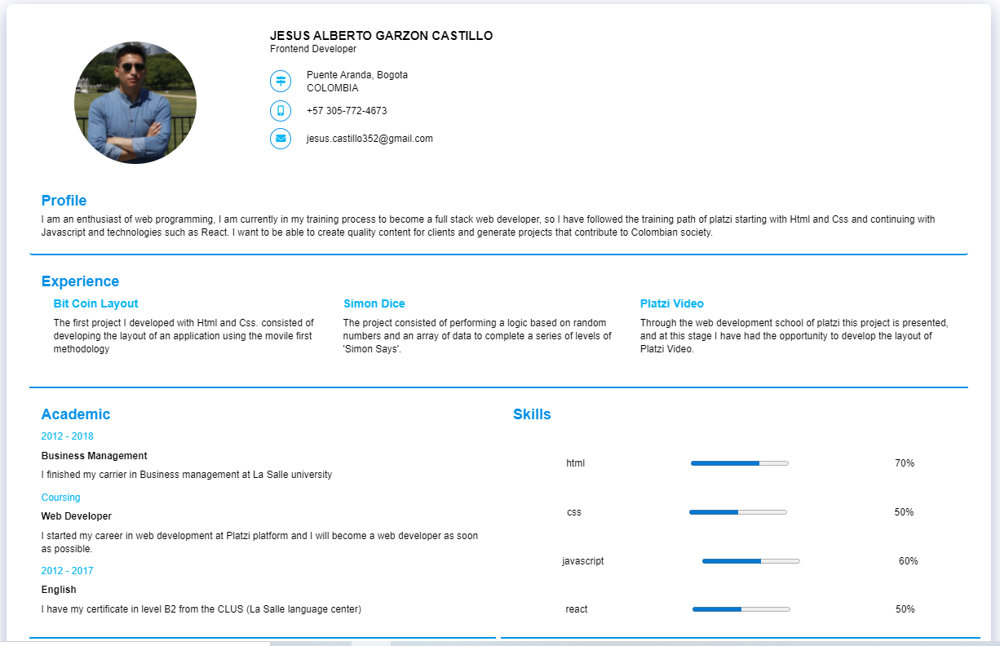

# frontend

## React Curriculum vitae

Crear tu curriculum vitae en React, analiza la estructura propuesta e inspirate para mostrar tu información.




## Docs ( 🛣️ Mi experiencia con el desafío )
<details>
<summary>Create the project components #1: Analyze the project and identify its structure</summary>
<br>
it was like a kind of simple structure, but the first thing i notice is that there where some components that have some diferences in the structure so i decided to work with grid in some cases and with flex in the major of structure.

</details>

<br>

<details>
<summary>
    Add styles #2: Create the styles to give it the desired design, keep the proposed structure. 
</summary>
<br>

This is the hardest part of the project for me, because in this issue I am a very simple person , may be I  like the minimalism a lot.  But the thing is that I had to do something different, and I did it, but as you see, at my own style(minimalism).
</details>

<br>

<details>
<summary>
Create getData.js function #3: Create getData.js function to consume an API</summary>
<br>
I  created the function but as a hook, and you can find it as  useData in the folder ./src/hook, it works very good.

</details>

<br>

<details>
<summary>Integrate API #4: Start the test server and integrate the proposed information into your application.
</summary>
<pre>
&lt; json-server -w -p 4000 data.json&gt;
</pre>
<br>

Integrating the API as a .json was easy, but i had have to learn about the api context, which is an easy way to distribute the info all accross the components, it took much time, but at the end it worked.
</details>

<br>

<details>
<summary>Custom API #5:Customize the data.json file in the root of the project with your information.
 
 </summary>
<br>
Customizing the api was quick, the issue was connect it, so I used the dependency  "json-server" to create a fake API.

</details>

<br>

<details>
<summary>Document #6:Create the necessary documentation for the application in the document of your Pull Request.
 Explain in detail the steps taken, describe what were your main blocks and your solutions.
 </summary>
<br>
To document the project I chose to use  the Readme.md to explain the steps of the project.

</details>

<br>

<br>

## ⚒️ Set Up
### 🚚 API
this is the first step for the rpoject to run.To run the API  you have to go to your terminal an run the next command:
json-server -w -p 4000 data.json


### 🛠️ Instalación
```
npm install
```

### 🏃 Ejecución
```
npm run start
```

### 💻 Server
```
json-server -w -p 4000 data.json
```

### 🧱 Compilar
```
npm run build
```

### ⚗️ Pruebas Unitarias
```
npm run test
```

### 🕵 ESlint
```
npm run lint
```


### Retos
1. [Crear los componentes del proyecto](https://github.com/platzimaster/frontend/issues/1)
2. [Añadir estilos](https://github.com/platzimaster/frontend/issues/2)
3. [Crear función getData.js](https://github.com/platzimaster/frontend/issues/3)
4. [Integrar API](https://github.com/platzimaster/frontend/issues/4)
5. [Personalizar API](https://github.com/platzimaster/frontend/issues/5)
6. [Documentar](https://github.com/platzimaster/frontend/issues/6)
### Enviar solución de reto
Debes de crear un "Fork" de este proyecto, revolver los problemas y crear un Pull Request hacia tu repositorio.

### Contribuir
Si alguien quiere agregar o mejorar algo, lo invito a colaborar directamente en este repositorio: [frontend](https://github.com/platzimaster/frontend/)

### Licencia
frontend se lanza bajo la licencia [MIT](https://opensource.org/licenses/MIT).
